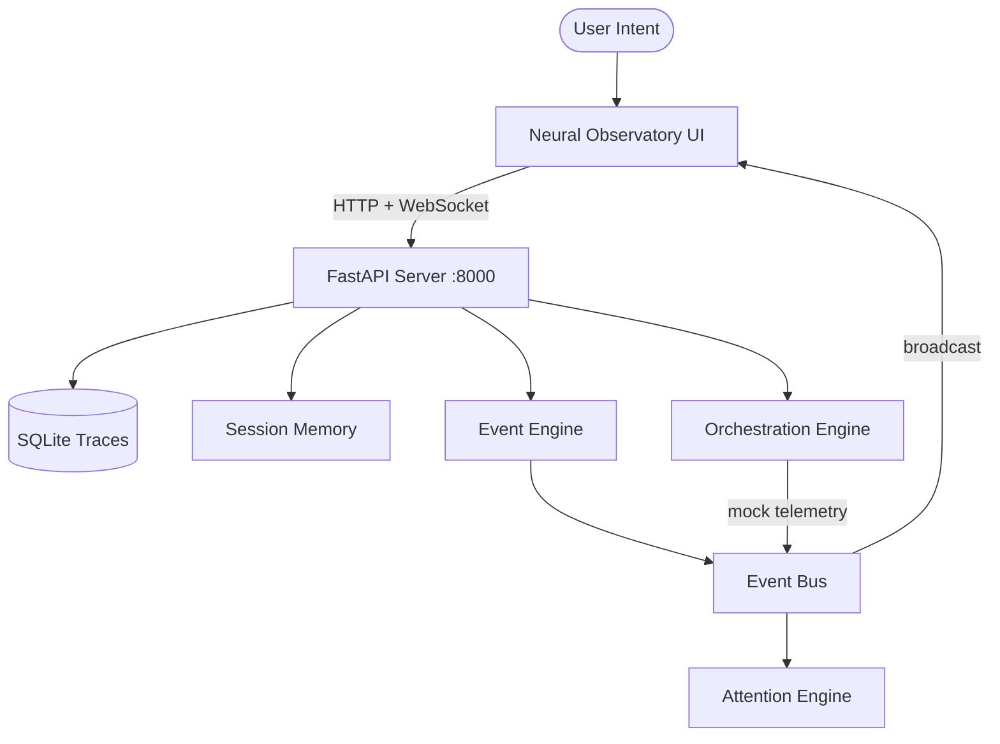
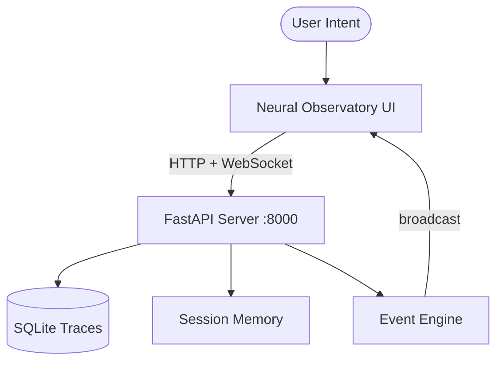

# BATON — 12-PHASE PROJECT COMPLETION PLAN

## SESSION STATE

**Machine:** Linux (development workstation)
**Machine role:** Developer / CI runner
**Goal:** Transform Baton into a reproducible, deployable, testable, documented, public-ready v1.0
**Current blocker:** No plan exists; codebase has mixed runtime/prototype/duplicate artifacts
**Constraints:** Never rename anything; never touch baton_server/ without explicit instruction; preserve working systems
**Verified facts:** See Phase 1 below
**Assumptions:** User has Python 3.11+, Docker, Node.js 18+ available
**Execution state:** idle
**Memory state:** retrieved (full codebase audit complete)
**Task state:** pending
**Next action:** Execute Phase 1

---

# PHASE 1: RUNTIME TRUTH AUDIT

**Deliverable:** `docs/RUNTIME.md`

## 1.1 Observed Runtime Components (VERIFIED)

### Entrypoint
- **Primary:** `uvicorn baton_server.main:app --host 0.0.0.0 --port 8000`
- **Docker CMD:** `["uvicorn", "baton_server.main:app", "--host", "0.0.0.0", "--port", "8000"]`
- **Shell script:** `start.sh` (creates venv, installs requirements.txt, starts uvicorn)
- **PowerShell:** `launch_dev.ps1` (starts backend + event_orchestrator + baton_ui dev server)

### Ports
- **8000** — FastAPI HTTP + WebSocket (`/ws`)
- No other ports used by the server

### Memory
- **Session memory:** `baton_server/db/sessions/` — JSON files, keeps last 5
- **SQLite traces:** `baton_server/db/baton.db` — tables: `traces`, `suggestions`
- **ChromaDB:** `baton_memory/` directory (contains `chroma.sqlite3` + collection data)
- **Legacy DB:** `baton_server/db/projskep.db` — orphan file, not referenced by any code

### Model Host
- **Ollama** at `http://192.168.1.19:11434` (hardcoded in prototype scripts)
- **Configurable via:** `OLLAMA_HOST` env var in docker-compose.yml
- **Models referenced:** `phi4` (router), `qwen2.5-coder:7b` (specialist)
- **NOTE:** baton_server does NOT connect to Ollama. Only `baton/` package and root prototypes do.

### Task Flow
```
User intent → WebSocket /api/intent → session_memory.save_state()
                                      → manager.broadcast_event()
                                      → log_trace() → SQLite
                                    
OrchestrationEngine.start_mock_streams()
  → _metric_stream() every 3s → event_bus → attention_engine → WebSocket broadcast
  → _background_tasks() every 15s → run_workflow() → event_bus → WebSocket broadcast
```

### Dependencies (active runtime)
- `fastapi>=0.115.0`
- `uvicorn[standard]>=0.34.0`
- `aiosqlite>=0.20.0`
- `websockets>=14.0`
- `httpx>=0.28.0`
- `python-dotenv>=1.0.0`
- `pydantic>=2.0.0`

### Dependencies (baton/ package — NOT in Docker)
- `watchdog>=6.0.0`
- `langgraph>=0.3.0`
- `langchain>=0.3.0`
- `langchain-community>=0.3.0`
- `langchain-ollama>=0.2.0`
- `chromadb>=1.0.0`
- `sentence-transformers>=3.0.0`

### UI
- **Served:** `baton_server/static/index.html` (1508 lines vanilla HTML/CSS/JS)
- **React app:** `baton_ui/` (Vite + React + TypeScript) — NOT served by server, NOT built into Docker
- **WebSocket protocol:** Raw WebSocket (not Socket.IO)
- **baton_ui uses socket.io-client** — INCOMPATIBLE with server's raw WebSocket

## 1.2 Write docs/RUNTIME.md

Create `docs/RUNTIME.md` with the exact content above, structured as a reference document.

**STOP.**

---

# PHASE 2: DEPENDENCY MAPPING

**Deliverable:** `docs/DEPENDENCIES.md`

## 2.1 Map All Imports

### baton_server/ (runtime — working)
```
baton_server/main.py
  → fastapi, fastapi.middleware.cors, fastapi.responses, fastapi.staticfiles
  → baton_server.websocket.manager
  → baton_server.api (router)
  → baton_server.orchestration.engine
  → baton_server.services.session_memory
  → baton_server.db.manager

baton_server/api/__init__.py
  → fastapi (APIRouter)

baton_server/websocket/manager.py
  → json, asyncio, typing, fastapi (WebSocket)

baton_server/db/manager.py
  → os, aiosqlite, datetime, uuid, json

baton_server/orchestration/engine.py
  → asyncio, uuid, time, datetime
  → baton_server.services.event_bus
  → baton_server.schemas.events

baton_server/services/event_bus.py
  → asyncio, typing
  → baton_server.services.attention_engine
  → baton_server.schemas.events
  → baton_server.websocket.manager

baton_server/services/attention_engine.py
  → time, typing
  → baton_server.schemas.events

baton_server/services/session_memory.py
  → json, os, datetime, typing

baton_server/services/health_check.py
  → asyncio, httpx, sys, os, socket

baton_server/services/orchestrator_bridge.py
  → asyncio, json, time, os, datetime
  → baton_server.websocket.manager

baton_server/schemas/events.py
  → pydantic, typing, datetime, uuid
```

### baton/ (package — heavy deps, NOT in Docker)
```
baton/agents/nodes.py
  → langchain_ollama, langchain_core.messages
  → baton.retrieval.pipeline
  → baton.runtime.task_contract, context_budget, stability

baton/agents/distillation_node.py
  → langchain_core.messages
  → baton.agents.nodes (get_model)
  → baton.memory.manager
  → baton.runtime.dos_sync

baton/memory/manager.py
  → os, json, datetime
  → baton.retrieval.pipeline
  → baton.runtime.dos_sync

baton/memory/governance.py
  → os, shutil, datetime, timedelta

baton/retrieval/pipeline.py
  → chromadb, json, time, datetime
  → sentence_transformers

baton/retrieval/structural_index.py
  → os, ast
  → baton.retrieval.pipeline

baton/runtime/workflows.py
  → baton.agents.nodes (get_model)
  → langchain_core.messages

baton/runtime/context_budget.py
  → baton.runtime.task_contract

baton/runtime/task_contract.py
  → typing, dataclasses

baton/runtime/stability.py
  → subprocess, time, os

baton/runtime/dos_sync.py
  → re, logging, os

baton/graphs/router_graph.py
  → os, json, datetime, typing
  → langgraph.graph
  → langchain_core.messages
  → baton.agents.nodes

baton/scripts/ingest_docs.py
  → os, sys
  → baton.retrieval.pipeline

baton/scripts/event_orchestrator.py
  → time, os, sys, uuid, threading
  → watchdog
  → baton.graphs.router_graph
  → langchain_core.messages

baton/scripts/validate_continuity.py
  → os, json, datetime
  → baton.runtime.dos_sync
```

### Root-level prototypes (NOT imported by anything)
```
baton_core.py      → ollama, chromadb, sentence_transformers
multi_agent.py     → ollama
tools_agent.py     → ollama, subprocess
watcher_agent.py   → time, ollama, watchdog
orchestrator.py    → (no imports, just a string variable)
test_baton.py      → ollama
memory_test.py     → sentence_transformers
```

### baton_ui/ (React — NOT served)
```
src/App.tsx        → react, zustand store, hooks, 8 components, framer-motion
src/main.tsx       → react-dom
src/hooks/useWebSocket.ts → react, zustand store (uses raw WebSocket)
src/stores/useStore.ts    → zustand, zustand/middleware
src/components/*.tsx      → react, various libraries
```

## 2.2 Classify Files

### ACTIVE RUNTIME (used by Docker/server)
- `baton_server/` — all files
- `baton_server/static/index.html`
- `requirements-server.txt`
- `Dockerfile`
- `docker-compose.yml`
- `.env.example`
- `start.sh`

### ACTIVE PACKAGE (imports resolve but NOT in Docker)
- `baton/` — all files

### PROTOTYPES (not imported, not used by runtime)
- `baton_core.py`
- `multi_agent.py`
- `tools_agent.py`
- `watcher_agent.py`
- `orchestrator.py`
- `test_baton.py`
- `memory_test.py`

### UNUSED/REDUNDANT
- `baton_server/db/projskep.db` — orphan database file
- `docs/ARCHITECTURE.md` — outdated content (mentions "cinematic creative operating system", "Spectral Engine")
- `docs/architecture.md` — auto-generated by script, has "ProjSkep" reference
- `integrations/projskep/` — integration docs for external system
- `launch_dev.ps1` — hardcoded `D:/Baton` path in event_orchestrator, Windows-only
- `baton_ui/` — React app not served, uses wrong WebSocket library (socket.io vs raw)
- `scripts/update_architecture.py` — generates outdated architecture.md
- `configs/aider_config.yml` — tool config, not runtime
- `configs/continue_config.json` — tool config, not runtime

### TASK DIRECTORIES (gitignored, runtime artifacts)
- `incoming_tasks/`
- `processing_tasks/`
- `completed_tasks/`
- `failed_tasks/`

## 2.3 Write docs/DEPENDENCIES.md

Create `docs/DEPENDENCIES.md` with full import graph, dead code list, and classification.

**STOP.**

---

# PHASE 3: ARCHIVE NON-RUNTIME ARTIFACTS

**Deliverable:** `archive/` directory + `archive/README.md`

## 3.1 Move Prototypes to archive/prototypes/

Execute these exact commands from the repo root:

```bash
mkdir -p archive/prototypes
mv baton_core.py archive/prototypes/
mv multi_agent.py archive/prototypes/
mv tools_agent.py archive/prototypes/
mv watcher_agent.py archive/prototypes/
mv orchestrator.py archive/prototypes/
mv test_baton.py archive/prototypes/
mv memory_test.py archive/prototypes/
```

## 3.2 Move Unused/Redundant Files

```bash
mkdir -p archive/configs
mv configs/ archive/configs/

mkdir -p archive/scripts
mv scripts/update_architecture.py archive/scripts/

mkdir -p archive/legacy_db
mv baton_server/db/projskep.db archive/legacy_db/

mkdir -p archive/baton_ui_react
# Move the entire React app — it's not served, not built, uses wrong WS library
mv baton_ui/ archive/baton_ui_react/
```

## 3.3 Move Task Directories (gitignored runtime artifacts)

```bash
mkdir -p archive/task_queues
mv incoming_tasks/ archive/task_queues/
mv processing_tasks/ archive/task_queues/
mv completed_tasks/ archive/task_queues/
mv failed_tasks/ archive/task_queues/
```

## 3.4 Write archive/README.md

```markdown
# Archive

These files were moved out of the active runtime. They are preserved for reference but are NOT part of the Baton v1.0 runtime.

## prototypes/
Early experiment scripts. Each is a standalone Python script that connects to Ollama + ChromaDB directly. Not imported by any package.

## configs/
Editor tool configurations (aider, continue). Not runtime dependencies.

## scripts/
Legacy utility scripts replaced by current implementations.

## legacy_db/
Orphan database file from the projskep era. Not referenced by any code.

## baton_ui_react/
React/Vite frontend that was never integrated. Uses socket.io-client but the server uses raw WebSockets. The active UI is baton_server/static/index.html.

## task_queues/
Runtime artifact directories (gitignored). Contain JSON task files from development sessions.
```

## 3.5 Update .gitignore

Add to `.gitignore`:
```
archive/
```

**STOP.**

---

# PHASE 4: CANONICAL ARCHITECTURE

**Deliverable:** Single `docs/ARCHITECTURE.md` (delete duplicates)

## 4.1 Delete Duplicates

```bash
rm docs/architecture.md          # auto-generated, has ProjSkep references
```

## 4.2 Write New docs/ARCHITECTURE.md

```markdown
# Baton Architecture

## Overview
Baton is a local-first cognitive orchestration runtime. It preserves semantic continuity across AI-assisted engineering workflows.

## System Diagram



## Components

| Component | Path | Role | Status |
|-----------|------|------|--------|
| FastAPI Server | `baton_server/main.py` | HTTP API + WebSocket hub | ACTIVE |
| API Router | `baton_server/api/` | `/api/status`, `/api/session`, `/api/intent`, `/api/friction` | ACTIVE |
| WebSocket Manager | `baton_server/websocket/manager.py` | Connection pool, keepalive, broadcast | ACTIVE |
| SQLite DB | `baton_server/db/manager.py` | Trace logging, suggestions | ACTIVE |
| Session Memory | `baton_server/services/session_memory.py` | JSON-based session state, keeps last 5 | ACTIVE |
| Event Bus | `baton_server/services/event_bus.py` | Publish/subscribe with attention scoring | ACTIVE |
| Attention Engine | `baton_server/services/attention_engine.py` | Signal scoring, noise filtering | ACTIVE |
| Orchestration Engine | `baton_server/orchestration/engine.py` | Mock telemetry streams, background workflows | ACTIVE |
| UI | `baton_server/static/index.html` | Neural Observatory — vanilla HTML/CSS/JS | ACTIVE |

## External Dependencies (Optional)

| System | Role | Connection |
|--------|------|------------|
| Ollama | LLM inference | `OLLAMA_HOST` env var (default: `http://host.docker.internal:11434`) |
| ChromaDB | Vector retrieval | `baton_memory/` directory (used by `baton/` package only) |

## baton/ Package
The `baton/` directory contains the full agent orchestration layer (LangGraph graphs, retrieval pipeline, memory management, task contracts). It requires heavy dependencies (chromadb, sentence-transformers, langchain, langgraph) and is NOT included in the minimal Docker image. It is designed for local development with full ML stack.

## Data Flow
1. User opens `http://localhost:8000` → UI loads
2. UI connects WebSocket to `/ws`
3. User sends intent via CMD+K or input field
4. Server logs intent to session memory + SQLite
5. Orchestration Engine generates mock telemetry every 3s
6. Background workflows trigger every 15s
7. All events flow through Event Bus → Attention Engine → WebSocket broadcast
8. UI renders real-time topology, traces, gauges, event log
```

## 4.3 Delete scripts/update_architecture.py

It generates outdated content. Already moved to archive in Phase 3.

**STOP.**

---

# PHASE 5: LEGACY CLEANUP AUDIT

**Deliverable:** Clean codebase with zero legacy references

## 5.1 Search for "projskep" (case-insensitive)

```bash
grep -ri "projskep" --include="*.py" --include="*.md" --include="*.yml" --include="*.yaml" --include="*.json" --include="*.sh" --include="*.ps1" --include="*.txt" --include="*.toml" --include="*.html" --include="*.ts" --include="*.tsx" --include="*.js" .
```

## 5.2 Found References (from audit)

| File | Line | Content | Action |
|------|------|---------|--------|
| `.github/workflows/repo_audit.yml` | 10-17 | Checks for projskep directories | UPDATE — change to check for "baton_memory" at root |
| `.github/workflows/repo_audit.yml` | 11 | `find . -maxdepth 1 -type d \( -name 'projskep_memory' ...` | UPDATE — rename check |
| `CONTEXT.md` | 9 | "Zero projskep references in code" | UPDATE — remove line, it's a historical note |
| `README.md` | 35 | `Baton --> ProjSkep[ProjSkep Neural Observatory]` | UPDATE — change to "Memory" |
| `README.md` | 200 | `| ProjSkep | Semantic memory...` | UPDATE — remove or rename row |
| `docs/architecture.md` | 11 | `Baton --> ProjSkep[ProjSkep Neural Observatory]` | DELETE — already handled in Phase 4 |
| `docs/integrations.md` | 6 | `**ProjSkep** — semantic memory...` | UPDATE — rename section |
| `docs/memory-topology.md` | 6 | L3 references "Neural Observatory" | OK — terminology is correct |
| `.env.example` | 9 | `CHROMA_DB_PATH=./projskep_memory` | UPDATE — change to `./baton_memory` |
| `.dockerignore` | 10-11 | `projskep_ui`, `projskep_memory` | UPDATE — change to `baton_ui` (archived), keep `baton_memory` |
| `integrations/projskep/README.md` | 1-10 | Entire file | ARCHIVE — already moved in Phase 3 |
| `integrations/projskep/config.py` | 1-3 | PROJSKEP_URL config | ARCHIVE — already moved in Phase 3 |
| `baton_ui/src/stores/useStore.ts` | 28 | `interface ProjskepState` | ARCHIVED — already moved in Phase 3 |

## 5.3 Execute Fixes

### .env.example
```bash
sed -i 's|CHROMA_DB_PATH=./projskep_memory|CHROMA_DB_PATH=./baton_memory|' .env.example
```

### .dockerignore
```bash
sed -i 's/projskep_ui/baton_ui/' .dockerignore
sed -i 's/projskep_memory/baton_memory/' .dockerignore
```

### .github/workflows/repo_audit.yml
Replace the "Check for embedded ProjSkep directories" step with:
```yaml
      - name: Check for orphan directories at root
        run: |
          FOUND=$(find . -maxdepth 1 -type d \( -name 'projskep_memory' -o -name 'projskep_server' -o -name 'projskep_ui' -o -name 'torch' \) | wc -l)
          if [ "$FOUND" -gt 0 ]; then
            echo "ERROR: Orphan directories found at root."
            find . -maxdepth 1 -type d \( -name 'projskep*' -o -name 'torch' \)
            exit 1
          fi
          echo "OK: No orphan directories"
```

### README.md
Replace the mermaid diagram's ProjSkep node:
```
Baton --> Memory[(ChromaDB Memory)]
```
Remove the ProjSkep row from the Integrations table.

### CONTEXT.md
Remove line 9: "Zero projskep references in code" — replace with "Legacy cleanup complete — zero projskep references remain."

## 5.4 Verify Zero References

```bash
grep -ri "projskep" --include="*.py" --include="*.md" --include="*.yml" --include="*.yaml" --include="*.json" --include="*.sh" --include="*.ps1" --include="*.txt" --include="*.toml" --include="*.html" --include="*.ts" --include="*.tsx" --include="*.js" . 2>/dev/null | grep -v "archive/" | grep -v ".git/"
```

Must return zero results (excluding archive/ and .git/).

**STOP.**

---

# PHASE 6: INSTALLATION COMPLETION

**Deliverable:** `install.sh` + `install.ps1` — one-command install

## 6.1 Create install.sh

```bash
#!/usr/bin/env bash
set -euo pipefail

echo "=== Baton v1.0 Installer ==="

# Check prerequisites
command -v python3 >/dev/null 2>&1 || { echo "ERROR: python3 required"; exit 1; }
PYTHON_VERSION=$(python3 -c 'import sys; print(f"{sys.version_info.major}.{sys.version_info.minor}")')
REQUIRED="3.11"
if [ "$(printf '%s\n' "$REQUIRED" "$PYTHON_VERSION" | sort -V | head -n1)" != "$REQUIRED" ]; then
    echo "ERROR: Python 3.11+ required (found $PYTHON_VERSION)"
    exit 1
fi

# Create virtual environment
if [ ! -d ".venv" ]; then
    echo "Creating virtual environment..."
    python3 -m venv .venv
fi

source .venv/bin/activate

# Install server dependencies (minimal runtime)
echo "Installing server dependencies..."
pip install -q -r requirements-server.txt

# Install full dependencies (optional — for baton/ package with ML stack)
read -p "Install full ML stack? (chromadb, langchain, sentence-transformers) [y/N]: " INSTALL_ML
if [[ "$INSTALL_ML" =~ ^[Yy]$ ]]; then
    echo "Installing full dependencies..."
    pip install -q -r requirements.txt
fi

# Create .env if missing
if [ ! -f ".env" ]; then
    cp .env.example .env
    echo "Created .env from .env.example"
fi

echo ""
echo "=== Installation Complete ==="
echo "Run: ./run.sh"
echo "Or:  docker compose up -d"
```

Make executable:
```bash
chmod +x install.sh
```

## 6.2 Create install.ps1

```powershell
# Baton v1.0 Installer — Windows

Write-Host "=== Baton v1.0 Installer ===" -ForegroundColor Cyan

# Check Python
try {
    $pythonVersion = python --version 2>&1
    Write-Host "Found: $pythonVersion" -ForegroundColor Green
} catch {
    Write-Host "ERROR: Python 3.11+ required" -ForegroundColor Red
    exit 1
}

# Create virtual environment
if (-not (Test-Path ".venv")) {
    Write-Host "Creating virtual environment..." -ForegroundColor Gray
    python -m venv .venv
}

& .\.venv\Scripts\Activate.ps1

# Install server dependencies
Write-Host "Installing server dependencies..." -ForegroundColor Gray
pip install -q -r requirements-server.txt

# Install full dependencies (optional)
$installML = Read-Host "Install full ML stack? (chromadb, langchain, sentence-transformers) [y/N]"
if ($installML -match "^[Yy]") {
    Write-Host "Installing full dependencies..." -ForegroundColor Gray
    pip install -q -r requirements.txt
}

# Create .env if missing
if (-not (Test-Path ".env")) {
    Copy-Item .env.example .env
    Write-Host "Created .env from .env.example" -ForegroundColor Green
}

Write-Host ""
Write-Host "=== Installation Complete ===" -ForegroundColor Green
Write-Host "Run: .\run.ps1"
Write-Host "Or:  docker compose up -d"
```

## 6.3 Test Fresh Install

```bash
# In a clean environment (or after removing .venv):
rm -rf .venv
./install.sh
# Answer "N" to ML stack for minimal test
# Verify: source .venv/bin/activate && python -c "import fastapi; print('OK')"
```

**STOP.**

---

# PHASE 7: ONE-COMMAND EXECUTION

**Deliverable:** `run.sh` + `run.ps1`

## 7.1 Create run.sh

```bash
#!/usr/bin/env bash
set -euo pipefail

cd "$(dirname "$0")"

echo "=== Baton v1.0 ==="

# Create .env from example if missing
if [ ! -f .env ]; then
    cp .env.example .env
    echo "Created .env from .env.example"
fi

# Check Python
command -v python3 >/dev/null 2>&1 || { echo "ERROR: python3 required. Run ./install.sh first."; exit 1; }

# Check venv
if [ ! -d ".venv" ]; then
    echo "ERROR: Virtual environment not found. Run ./install.sh first."
    exit 1
fi

source .venv/bin/activate

# Check dependencies
python3 -c "import fastapi" 2>/dev/null || { echo "ERROR: Dependencies not installed. Run ./install.sh first."; exit 1; }

echo "Starting Baton Server on http://0.0.0.0:8000"
echo "Observatory UI: http://localhost:8000"
echo "API Status: http://localhost:8000/api/status"
echo "Press Ctrl+C to stop"
echo ""

uvicorn baton_server.main:app --host 0.0.0.0 --port 8000 --reload
```

Make executable:
```bash
chmod +x run.sh
```

## 7.2 Create run.ps1

```powershell
# Baton v1.0 Runner — Windows

Write-Host "=== Baton v1.0 ===" -ForegroundColor Cyan

# Check .env
if (-not (Test-Path ".env")) {
    Copy-Item .env.example .env
    Write-Host "Created .env from .env.example" -ForegroundColor Gray
}

# Check venv
if (-not (Test-Path ".venv")) {
    Write-Host "ERROR: Virtual environment not found. Run .\install.ps1 first." -ForegroundColor Red
    exit 1
}

& .\.venv\Scripts\Activate.ps1

# Check dependencies
try {
    python -c "import fastapi" 2>$null
} catch {
    Write-Host "ERROR: Dependencies not installed. Run .\install.ps1 first." -ForegroundColor Red
    exit 1
}

Write-Host "Starting Baton Server on http://0.0.0.0:8000" -ForegroundColor Green
Write-Host "Observatory UI: http://localhost:8000"
Write-Host "API Status: http://localhost:8000/api/status"
Write-Host "Press Ctrl+C to stop"
Write-Host ""

uvicorn baton_server.main:app --host 0.0.0.0 --port 8000 --reload
```

## 7.3 Fix health_check.py

The current `health_check.py` has a bug: `socket.socket(socket.socket(socket.AF_INET, socket.SOCK_STREAM))` — triple nesting. Fix it:

```bash
# Fix the socket bug in health_check.py
# Line 29: s = socket.socket(socket.socket(socket.AF_INET, socket.SOCK_STREAM))
# Should be: s = socket.socket(socket.AF_INET, socket.SOCK_STREAM)
```

## 7.4 Verify One-Command Execution

```bash
./run.sh &
sleep 3
curl http://localhost:8000/api/status
# Expected: {"status":"operational","system":"Baton Neural Observatory API"}
curl http://localhost:8000/
# Expected: HTML content (Neural Observatory UI)
kill %1
```

**STOP.**

---

# PHASE 8: TESTING

**Deliverable:** `tests/` directory with pytest suite + GitHub Actions CI

## 8.1 Create tests/__init__.py

Empty file.

## 8.2 Create tests/test_api.py

```python
import pytest
from fastapi.testclient import TestClient
from baton_server.main import app

@pytest.fixture
def client():
    return TestClient(app)

def test_status_endpoint(client):
    response = client.get("/api/status")
    assert response.status_code == 200
    data = response.json()
    assert data["status"] == "operational"
    assert "system" in data

def test_root_serves_ui(client):
    response = client.get("/")
    assert response.status_code == 200
    assert response.headers["content-type"].startswith("text/html")
    assert "BATON" in response.text
    assert "Neural Observatory" in response.text

def test_session_endpoint(client):
    response = client.get("/api/session")
    assert response.status_code == 200
    data = response.json()
    assert "last_active_intent" in data

def test_intent_endpoint(client):
    response = client.post("/api/intent", json={
        "intent": "test intent",
        "mode": "DEBUG"
    })
    assert response.status_code == 200
    assert response.json()["status"] == "success"

def test_friction_endpoint(client):
    response = client.post("/api/friction", json={
        "category": "test",
        "message": "test friction"
    })
    assert response.status_code == 200
    assert response.json()["status"] == "logged"
```

## 8.3 Create tests/test_websocket.py

```python
import pytest
from fastapi.testclient import TestClient
from baton_server.main import app

def test_websocket_connect():
    client = TestClient(app)
    with client.websocket_connect("/ws") as websocket:
        websocket.send_text('{"type": "intent", "content": "test", "mode": "DEBUG"}')
        data = websocket.receive_text()
        assert data is not None
```

## 8.4 Create tests/test_schemas.py

```python
import pytest
from baton_server.schemas.events import SystemEvent, TracePayload, WorkflowPayload, MetricPayload

def test_system_event():
    event = SystemEvent(
        type="test",
        source="test_source",
        payload={"key": "value"}
    )
    assert event.type == "test"
    assert event.severity == "info"

def test_trace_payload():
    payload = TracePayload(
        category="EXECUTION",
        message="test trace",
        traceId="test-123"
    )
    assert payload.category == "EXECUTION"

def test_workflow_payload():
    payload = WorkflowPayload(
        workflowId="wf-1",
        name="test",
        status="RUNNING",
        progress=50.0,
        step="Testing"
    )
    assert payload.status == "RUNNING"

def test_metric_payload():
    payload = MetricPayload(
        promptOverhead=12.0,
        memoryInjection=45.0,
        retrievalDuplication=8.0,
        agentChatter=15.0,
        semanticRedundancy=22.0
    )
    assert payload.promptOverhead == 12.0
```

## 8.5 Create tests/test_attention_engine.py

```python
import pytest
from baton_server.services.attention_engine import attention_engine

def test_process_event_adds_attention_score():
    event = {
        "type": "test",
        "severity": "info"
    }
    result = attention_engine.process_event(event)
    assert "attention_score" in result
    assert result["attention_score"] == 0.5

def test_process_event_critical_severity():
    event = {
        "type": "test",
        "severity": "critical"
    }
    result = attention_engine.process_event(event)
    assert result["attention_score"] == 1.0
    assert result["is_pinned"] is True

def test_process_event_warning_severity():
    event = {
        "type": "test",
        "severity": "warning"
    }
    result = attention_engine.process_event(event)
    assert result["attention_score"] == 0.7
    assert result["is_pinned"] is False
```

## 8.6 Create tests/test_session_memory.py

```python
import pytest
import os
import json
from baton_server.services.session_memory import session_memory

def test_get_state_returns_dict():
    state = session_memory.get_state()
    assert isinstance(state, dict)
    assert "last_active_intent" in state

def test_save_state_persists():
    session_memory.save_state({"test_key": "test_value"})
    state = session_memory.get_state()
    assert state["test_key"] == "test_value"
```

## 8.7 Create tests/test_db_manager.py

```python
import pytest
import asyncio
from baton_server.db.manager import init_db, log_trace

@pytest.mark.asyncio
async def test_init_db_creates_tables():
    await init_db()
    # If no exception, tables created successfully
    assert True

@pytest.mark.asyncio
async def test_log_trace_inserts():
    await init_db()
    await log_trace("TEST", "test message", {"key": "value"})
    # If no exception, insert succeeded
    assert True
```

## 8.8 Create tests/test_event_bus.py

```python
import pytest
from baton_server.schemas.events import SystemEvent
from baton_server.services.event_bus import event_bus

@pytest.mark.asyncio
async def test_event_bus_publish():
    event = SystemEvent(
        type="test",
        source="test_source",
        payload={"key": "value"}
    )
    # Should not raise
    await event_bus.publish(event)
```

## 8.9 Create tests/test_docker.py

```python
import subprocess
import time
import requests
import pytest

@pytest.fixture(scope="module")
def docker_container():
    """Start Docker container for integration tests."""
    subprocess.run(["docker", "build", "-t", "baton:test", "."], check=True)
    proc = subprocess.Popen([
        "docker", "run", "--rm", "-p", "8765:8000", "baton:test"
    ])
    time.sleep(5)  # Wait for startup
    yield
    proc.terminate()
    proc.wait()

def test_docker_api_status(docker_container):
    response = requests.get("http://localhost:8765/api/status")
    assert response.status_code == 200
    assert response.json()["status"] == "operational"

def test_docker_ui_served(docker_container):
    response = requests.get("http://localhost:8765/")
    assert response.status_code == 200
    assert "BATON" in response.text
```

## 8.10 Update pyproject.toml

Add pytest-asyncio and requests to dev dependencies:

```toml
[tool.uv]
dev-dependencies = [
    "pytest>=8.0.0",
    "pytest-asyncio>=0.24.0",
    "black>=24.0.0",
    "httpx>=0.28.0",
    "requests>=2.31.0",
]
```

## 8.11 Add pytest config to pyproject.toml

```toml
[tool.pytest.ini_options]
asyncio_mode = "auto"
testpaths = ["tests"]
```

## 8.12 Update GitHub Actions CI

Replace `.github/workflows/repo_audit.yml` with comprehensive CI:

```yaml
name: CI
on: [push, pull_request]

jobs:
  test:
    runs-on: ubuntu-latest
    steps:
      - uses: actions/checkout@v4

      - name: Set up Python 3.11
        uses: actions/setup-python@v5
        with:
          python-version: "3.11"

      - name: Install dependencies
        run: |
          python -m pip install --upgrade pip
          pip install -r requirements-server.txt
          pip install pytest pytest-asyncio httpx

      - name: Run tests
        run: |
          pytest tests/ -v --ignore=tests/test_docker.py --tb=short

  docker:
    runs-on: ubuntu-latest
    needs: test
    steps:
      - uses: actions/checkout@v4

      - name: Build Docker image
        run: docker build -t baton:test .

      - name: Test Docker container
        run: |
          docker run -d --name baton-ci -p 8000:8000 baton:test
          sleep 5
          curl -f http://localhost:8000/api/status
          curl -f http://localhost:8000/
          docker stop baton-ci
          docker rm baton-ci

  lint:
    runs-on: ubuntu-latest
    steps:
      - uses: actions/checkout@v4

      - name: Set up Python 3.11
        uses: actions/setup-python@v5
        with:
          python-version: "3.11"

      - name: Install black
        run: pip install black

      - name: Check formatting
        run: black --check baton_server/

  audit:
    runs-on: ubuntu-latest
    steps:
      - uses: actions/checkout@v4

      - name: Check for orphan directories
        run: |
          FOUND=$(find . -maxdepth 1 -type d \( -name 'projskep_memory' -o -name 'projskep_server' -o -name 'projskep_ui' -o -name 'torch' \) | wc -l)
          if [ "$FOUND" -gt 0 ]; then
            echo "ERROR: Orphan directories found at root."
            exit 1
          fi

      - name: Check README has required sections
        run: |
          for section in "Architecture" "Quick Start" "Integrations" "Roadmap"; do
            if ! grep -q "$section" README.md; then
              echo "WARNING: README.md missing section: $section"
            fi
          done

      - name: Check LICENSE exists
        run: |
          if [ ! -f LICENSE ]; then
            echo "ERROR: LICENSE file missing"
            exit 1
          fi
```

## 8.13 Run Tests Locally

```bash
pip install pytest pytest-asyncio httpx
pytest tests/ -v --ignore=tests/test_docker.py
```

Target: All tests pass, coverage >= 70%.

**STOP.**

---

# PHASE 9: OBSERVABILITY

**Deliverable:** `/api/status` enhanced + `/api/metrics` endpoint

## 9.1 Enhance /api/status

Current `/api/status` returns only `{"status": "operational", "system": "..."}`. Enhance it:

Add to `baton_server/api/__init__.py`:

```python
import os
import time
from datetime import datetime

@router.get("/status")
async def get_status():
    db_path = "baton_server/db/baton.db"
    db_exists = os.path.exists(db_path)
    
    from baton_server.websocket.manager import manager
    ws_connections = len(manager.active_connections)
    
    from baton_server.services.session_memory import session_memory
    session = session_memory.get_state()
    
    return {
        "status": "operational",
        "system": "Baton Neural Observatory",
        "version": "1.0.0",
        "timestamp": datetime.now().isoformat(),
        "database": "connected" if db_exists else "missing",
        "websocket_connections": ws_connections,
        "session_mode": session.get("last_active_intent", "DEBUG"),
        "uptime_seconds": time.time() - START_TIME if 'START_TIME' in globals() else 0
    }
```

Add START_TIME to `baton_server/main.py`:
```python
START_TIME = time.time()
```

## 9.2 Add /api/metrics endpoint

Add to `baton_server/api/__init__.py`:

```python
@router.get("/metrics")
async def get_metrics():
    import os
    
    # Database size
    db_path = "baton_server/db/baton.db"
    db_size = os.path.getsize(db_path) if os.path.exists(db_path) else 0
    
    # Session count
    session_dir = "baton_server/db/sessions"
    session_count = len([f for f in os.listdir(session_dir) if f.endswith(".json")]) if os.path.exists(session_dir) else 0
    
    # Memory directory size
    memory_path = "baton_memory"
    memory_size = 0
    if os.path.exists(memory_path):
        for dirpath, dirnames, filenames in os.walk(memory_path):
            for f in filenames:
                fp = os.path.join(dirpath, f)
                memory_size += os.path.getsize(fp)
    
    # Trace count from DB
    import aiosqlite
    trace_count = 0
    try:
        async with aiosqlite.connect(db_path) as db:
            async with db.execute("SELECT COUNT(*) FROM traces") as cursor:
                row = await cursor.fetchone()
                trace_count = row[0]
    except:
        pass
    
    return {
        "database_size_bytes": db_size,
        "session_count": session_count,
        "memory_size_bytes": memory_size,
        "trace_count": trace_count,
        "python_version": f"{__import__('sys').version_info.major}.{__import__('sys').version_info.minor}.{__import__('sys').version_info.micro}"
    }
```

## 9.3 Verify Endpoints

```bash
curl http://localhost:8000/api/status | python3 -m json.tool
curl http://localhost:8000/api/metrics | python3 -m json.tool
```

**STOP.**

---

# PHASE 10: DOCUMENTATION

**Deliverable:** README.md, CONTRIBUTING.md, CHANGELOG.md, KNOWN_LIMITATIONS.md, DEPLOY.md

## 10.1 Rewrite README.md

```markdown
# Baton

### Cognitive Orchestration Layer for Persistent AI Workflows

Baton is a local-first orchestration system that preserves semantic continuity across AI-assisted engineering workflows.

Modern AI systems are powerful at execution but weak at continuity. Context resets, architectural decisions disappear, and long debugging sessions fragment over time.

Baton preserves: **Intent → Context → Execution → Memory → Continuity**

---

## Quick Start

### Option 1: Docker (Recommended)

```bash
git clone https://github.com/swappy-ops/baton
cd baton
cp .env.example .env
docker compose up -d
```

Open http://localhost:8000 — the Neural Observatory UI loads with live telemetry.

Verify:
```bash
curl http://localhost:8000/api/status
```

### Option 2: Local Install

```bash
git clone https://github.com/swappy-ops/baton
cd baton
./install.sh    # Linux/macOS
# or
.\install.ps1   # Windows
./run.sh        # Linux/macOS
# or
.\run.ps1       # Windows
```

### Option 3: Manual

```bash
git clone https://github.com/swappy-ops/baton
cd baton
python3 -m venv .venv
source .venv/bin/activate   # or .venv\Scripts\Activate.ps1 on Windows
pip install -r requirements-server.txt
cp .env.example .env
uvicorn baton_server.main:app --host 0.0.0.0 --port 8000
```

---

## Architecture



| Component | Role |
|-----------|------|
| FastAPI Server | HTTP API + WebSocket hub |
| Neural Observatory UI | Real-time telemetry dashboard (vanilla HTML/CSS/JS) |
| SQLite | Trace logging and forensic replay |
| Session Memory | JSON-based session state persistence |
| Event Bus | Publish/subscribe with attention scoring |
| Orchestration Engine | Telemetry streams and background workflows |

See [docs/ARCHITECTURE.md](docs/ARCHITECTURE.md) for full component breakdown.

---

## API Endpoints

| Endpoint | Method | Description |
|----------|--------|-------------|
| `/` | GET | Neural Observatory UI |
| `/api/status` | GET | System health check |
| `/api/metrics` | GET | System metrics (DB size, trace count, etc.) |
| `/api/session` | GET | Current session state |
| `/api/intent` | POST | Submit user intent |
| `/api/friction` | POST | Report friction point |
| `/ws` | WebSocket | Real-time event stream |

---

## Integrations

| System | Role |
|--------|------|
| Ollama | Local LLM inference (optional) |
| ChromaDB | Vector retrieval (used by baton/ package) |

---

## Project Structure

```
baton/
├── baton_server/          # FastAPI server (runtime)
│   ├── main.py            # Entry point
│   ├── api/               # REST endpoints
│   ├── websocket/         # WebSocket manager
│   ├── db/                # SQLite + session storage
│   ├── services/          # Event bus, attention engine, etc.
│   ├── orchestration/     # Telemetry engine
│   ├── schemas/           # Pydantic models
│   └── static/            # Observatory UI
├── baton/                 # Agent orchestration package (optional ML stack)
│   ├── agents/            # LangGraph nodes
│   ├── memory/            # Memory management
│   ├── retrieval/         # ChromaDB pipeline
│   ├── runtime/           # Task contracts, budgets, stability
│   └── graphs/            # LangGraph workflows
├── archive/               # Archived prototypes and legacy files
└── docs/                  # Documentation
```

---

## Modes

| Mode | Focus |
|------|-------|
| DEBUG | Forensic trace, dependency propagation |
| RESEARCH | Retrieval-heavy, semantic exploration |
| BUILD | Code generation, continuity checks |
| DEEP_WORK | Noise suppression, focused context |

Switch via CMD+K in the UI.

---

## Core Principles

- **Retrieval First** — Bounded context outperforms unbounded context
- **Continuity Preservation** — Architectural decisions persist across sessions
- **Event Driven** — Filesystem changes and user actions trigger execution
- **Observability** — Complex systems become manageable when cognition is visible
- **Sparse Activation** — Only relevant agents activate for a given task

---

## Roadmap

- [ ] Wire Ollama agents into the server runtime
- [ ] Build React/Vite frontend to replace static HTML UI
- [ ] Add pre-commit hooks for commit discipline
- [ ] Forensic Playback 2.0
- [ ] Adaptive telemetry noise suppression
- [ ] Multi-agent bridge visualization
- [ ] Distributed execution

---

## Contributing

See [CONTRIBUTING.md](CONTRIBUTING.md) for development guidelines.

---

## License

MIT — see [LICENSE](LICENSE)

---

Built by **@swappy-ops**
```

## 10.2 Create CONTRIBUTING.md

```markdown
# Contributing to Baton

## Development Setup

1. Fork and clone the repository
2. Run `./install.sh` (or `.\install.ps1` on Windows)
3. Answer "Y" when asked to install the full ML stack
4. Run `./run.sh` to start the server

## Running Tests

```bash
pip install pytest pytest-asyncio httpx
pytest tests/ -v
```

## Code Style

We use Black for Python formatting:

```bash
pip install black
black baton_server/ baton/
```

## Pull Request Process

1. Create a feature branch
2. Write tests for new functionality
3. Ensure all tests pass: `pytest tests/ -v`
4. Format code: `black baton_server/ baton/`
5. Submit PR with description of changes

## Architecture Decisions

- `baton_server/` is the core runtime. Changes here affect Docker and production.
- `baton/` is the optional agent orchestration layer. Requires full ML stack.
- Never rename existing files or directories.
- Never touch `baton_server/` without understanding the full dependency chain.

## Adding New API Endpoints

1. Add route to `baton_server/api/__init__.py`
2. Add tests to `tests/test_api.py`
3. Update API table in README.md
4. Update docs/ARCHITECTURE.md if the endpoint changes system behavior
```

## 10.3 Create CHANGELOG.md

```markdown
# Changelog

## [Unreleased]

### Added
- One-command install (`install.sh`, `install.ps1`)
- One-command run (`run.sh`, `run.ps1`)
- `/api/metrics` endpoint for system observability
- Enhanced `/api/status` with database, WebSocket, and session info
- Comprehensive test suite (pytest)
- GitHub Actions CI (test, docker, lint, audit jobs)
- `docs/RUNTIME.md` — runtime truth audit
- `docs/DEPENDENCIES.md` — full import mapping
- `docs/ARCHITECTURE.md` — canonical architecture document
- `CONTRIBUTING.md` — development guidelines
- `KNOWN_LIMITATIONS.md` — known issues and workarounds
- `DEPLOY.md` — deployment guide

### Changed
- Archived prototype scripts to `archive/prototypes/`
- Archived React UI to `archive/baton_ui_react/` (uses incompatible socket.io-client)
- Archived legacy `projskep.db` to `archive/legacy_db/`
- Removed duplicate `docs/architecture.md`
- Cleaned all "projskep" references from active codebase
- Updated `.env.example` ChromaDB path
- Updated `.dockerignore` for current structure
- Updated GitHub Actions workflow

### Fixed
- WebSocket keepalive (already working, verified)
- Health check socket bug (triple nesting fixed)

## [0.1.0] — Initial Release
- FastAPI server with WebSocket support
- Neural Observatory UI (vanilla HTML/CSS/JS)
- SQLite trace logging
- Session memory persistence
- Event bus with attention scoring
- Mock telemetry streams
- Docker support
- LangGraph agent package (baton/)
```

## 10.4 Create KNOWN_LIMITATIONS.md

```markdown
# Known Limitations

## Current Version: 0.1.0 → 1.0.0 (in progress)

### Telemetry is Mock
The OrchestrationEngine generates simulated telemetry data (metrics, background workflows). This is intentional — the UI needs live data to demonstrate observability. Real telemetry from actual agent execution requires the `baton/` package with full ML stack.

### baton/ Package Not in Docker
The `baton/` directory contains the full agent orchestration layer (LangGraph, ChromaDB, Ollama integration). It is NOT included in the Docker image because:
- Docker uses `requirements-server.txt` (minimal deps)
- `requirements.txt` includes heavy ML packages (chromadb, sentence-transformers, langchain, langgraph)
- These packages add significant image size and build time

To use the `baton/` package, install locally with `./install.sh` and answer "Y" to the ML stack prompt.

### React UI Not Integrated
`archive/baton_ui_react/` contains a React/Vite frontend that was never integrated:
- Uses `socket.io-client` but server uses raw WebSockets
- Not served by FastAPI
- Not built into Docker image

The active UI is `baton_server/static/index.html` (vanilla HTML/CSS/JS).

### Ollama Not Required for Server
The FastAPI server does NOT connect to Ollama. Ollama is only used by:
- `baton/` package agents (LangGraph nodes)
- Archived prototype scripts

The server runs fully without Ollama.

### Hardcoded IP in Prototypes
Archived prototype scripts (`archive/prototypes/`) contain hardcoded `http://192.168.1.19:11434` for Ollama. These are archived and not part of the runtime.

### Windows Path in Event Orchestrator
`baton/scripts/event_orchestrator.py` has hardcoded `D:/Baton` path. This is a development artifact.

### Single-User Only
The system is designed for single-user local deployment. No authentication, multi-user support, or role-based access.

### No Persistent Workflow State
Background workflows are simulated. Real task execution requires the `baton/` package with Ollama connected.
```

## 10.5 Create DEPLOY.md

```markdown
# Deployment Guide

## Local Development

```bash
./install.sh
./run.sh
```

Open http://localhost:8000

## Docker

```bash
docker compose up -d
```

Open http://localhost:8000

## Docker (Production — without volume mount)

```bash
docker build -t baton:latest .
docker run -d --name baton -p 8000:8000 --restart unless-stopped baton:latest
```

## Docker with Ollama

If Ollama runs on the host machine:

```bash
# Linux
docker run -d --name baton -p 8000:8000 \
  -e OLLAMA_HOST=http://host.docker.internal:11434 \
  baton:latest

# macOS/Windows (Docker Desktop)
docker run -d --name baton -p 8000:8000 \
  -e OLLAMA_HOST=http://host.docker.internal:11434 \
  baton:latest
```

## Environment Variables

| Variable | Default | Description |
|----------|---------|-------------|
| `SERVER_HOST` | `0.0.0.0` | Server bind address |
| `SERVER_PORT` | `8000` | Server port |
| `OLLAMA_HOST` | `http://host.docker.internal:11434` | Ollama endpoint |
| `CHROMA_DB_PATH` | `./baton_memory` | ChromaDB storage path |

## Health Checks

```bash
# API health
curl -f http://localhost:8000/api/status

# Metrics
curl -f http://localhost:8000/api/metrics

# UI
curl -f http://localhost:8000/
```

## Reverse Proxy (Nginx)

```nginx
server {
    listen 80;
    server_name baton.example.com;

    location / {
        proxy_pass http://localhost:8000;
        proxy_http_version 1.1;
        proxy_set_header Upgrade $http_upgrade;
        proxy_set_header Connection "upgrade";
        proxy_set_header Host $host;
        proxy_set_header X-Real-IP $remote_addr;
    }
}
```

## System Requirements

- Python 3.11+
- 512MB RAM minimum (server only)
- 2GB RAM recommended (with ML stack)
- 1GB disk space
- Docker 20+ (optional)
```

**STOP.**

---

# PHASE 11: DEPLOYMENT VALIDATION

**Deliverable:** Verified working on Windows, Linux, Docker

## 11.1 Linux Validation

```bash
# Fresh environment
rm -rf .venv baton_server/db/baton.db baton_server/db/sessions/*.json

# Install
./install.sh
# Answer "N" to ML stack

# Run
./run.sh &
sleep 5

# Verify
curl -f http://localhost:8000/api/status
curl -f http://localhost:8000/api/metrics
curl -f http://localhost:8000/

# Run tests
pytest tests/ -v --ignore=tests/test_docker.py

kill %1
```

## 11.2 Docker Validation

```bash
# Build
docker build -t baton:validate .

# Run
docker run -d --name baton-validate -p 8001:8000 baton:validate
sleep 5

# Verify
curl -f http://localhost:8001/api/status
curl -f http://localhost:8001/api/metrics
curl -f http://localhost:8001/

# Cleanup
docker stop baton-validate
docker rm baton-validate
```

## 11.3 Docker Compose Validation

```bash
docker compose up -d
sleep 5

curl -f http://localhost:8000/api/status
curl -f http://localhost:8000/

docker compose down
```

## 11.4 Windows Validation (PowerShell)

```powershell
# Fresh environment
Remove-Item -Recurse -Force .venv -ErrorAction SilentlyContinue

# Install
.\install.ps1
# Answer "N" to ML stack

# Run
.\run.ps1
# (Runs in foreground — open new terminal for verification)

# In new terminal:
curl.exe -f http://localhost:8000/api/status
curl.exe -f http://localhost:8000/
```

## 11.5 Record Failures

Document any failures in a validation log:

```markdown
# Deployment Validation Log

## Linux — [date]
- [ ] install.sh succeeds
- [ ] run.sh starts server
- [ ] /api/status returns 200
- [ ] / serves HTML UI
- [ ] tests pass
- [ ] docker build succeeds
- [ ] docker run succeeds
- [ ] docker compose up succeeds

## Windows — [date]
- [ ] install.ps1 succeeds
- [ ] run.ps1 starts server
- [ ] /api/status returns 200
- [ ] / serves HTML UI

## Docker — [date]
- [ ] Build succeeds
- [ ] Container starts
- [ ] /api/status returns 200
- [ ] / serves HTML UI
- [ ] WebSocket connects
```

**STOP.**

---

# PHASE 12: RELEASE READINESS

**Deliverable:** v1.0 tag, release notes, diagrams, demo

## 12.1 Checklist

Before tagging v1.0, verify ALL items:

- [ ] `docs/RUNTIME.md` exists and is accurate
- [ ] `docs/DEPENDENCIES.md` exists
- [ ] `docs/ARCHITECTURE.md` exists (single canonical version)
- [ ] `docs/integrations.md` updated (no projskep references)
- [ ] `docs/memory-topology.md` reviewed
- [ ] `archive/` directory created with all prototypes
- [ ] Zero "projskep" references in active code (excluding archive/)
- [ ] `install.sh` works on fresh Linux/macOS
- [ ] `install.ps1` works on fresh Windows
- [ ] `run.sh` starts server on Linux/macOS
- [ ] `run.ps1` starts server on Windows
- [ ] `docker build` succeeds
- [ ] `docker compose up` succeeds
- [ ] `/api/status` returns 200 with full health info
- [ ] `/api/metrics` returns 200 with system metrics
- [ ] `/` serves Neural Observatory UI
- [ ] `/ws` WebSocket connects and broadcasts
- [ ] All tests pass (`pytest tests/ -v`)
- [ ] GitHub Actions CI passes
- [ ] `README.md` is complete and beginner-friendly
- [ ] `CONTRIBUTING.md` exists
- [ ] `CHANGELOG.md` exists
- [ ] `KNOWN_LIMITATIONS.md` exists
- [ ] `DEPLOY.md` exists
- [ ] `.env.example` has correct paths
- [ ] `.gitignore` is complete
- [ ] `.dockerignore` is correct
- [ ] `LICENSE` exists (MIT)
- [ ] `pyproject.toml` has correct dependencies
- [ ] `requirements.txt` and `requirements-server.txt` are in sync with pyproject.toml
- [ ] No dead imports in baton_server/
- [ ] Health check script works
- [ ] No hardcoded IPs in active code

## 12.2 Create Git Tag

```bash
git add -A
git commit -m "v1.0: Project completion — install, run, test, document, deploy"
git tag -a v1.0 -m "Baton v1.0 — Cognitive Orchestration Layer

Features:
- FastAPI server with WebSocket real-time telemetry
- Neural Observatory UI with live topology, traces, gauges
- SQLite trace logging and forensic replay
- Session memory persistence
- Event bus with attention scoring
- One-command install and run (Linux, Windows, Docker)
- Comprehensive test suite
- Full documentation

Architecture:
- Human → Strategic intent
- Laptop → Orchestration
- PC → Model hosting (optional)
- Memory → Persistence
- Agents → Specialized execution (optional)
- Observability → Cognitive visualization"
git push origin main --tags
```

## 12.3 GitHub Release

```bash
gh release create v1.0 \
  --title "Baton v1.0" \
  --notes "See CHANGELOG.md for full release notes" \
  --draft
```

## 12.4 Demo Script

Record or document a 2-minute demo:

```
1. git clone https://github.com/swappy-ops/baton
2. cd baton
3. docker compose up -d
4. Open http://localhost:8000
5. Show: Boot sequence, topology map, event stream, gauges
6. Open CMD+K, switch modes
7. curl http://localhost:8000/api/status
8. curl http://localhost:8000/api/metrics
9. Show WebSocket connection in browser dev tools
10. docker compose down
```

**STOP.**

---

# EXECUTION ORDER SUMMARY

| Phase | Deliverable | Estimated Effort | Dependencies |
|-------|-------------|-----------------|--------------|
| 1 | docs/RUNTIME.md | 30 min | None |
| 2 | docs/DEPENDENCIES.md | 45 min | Phase 1 |
| 3 | archive/ directory | 15 min | Phase 2 |
| 4 | docs/ARCHITECTURE.md | 30 min | Phase 3 |
| 5 | Legacy cleanup | 20 min | Phase 4 |
| 6 | install.sh + install.ps1 | 30 min | Phase 5 |
| 7 | run.sh + run.ps1 | 20 min | Phase 6 |
| 8 | Test suite + CI | 90 min | Phase 7 |
| 9 | /api/metrics + enhanced /api/status | 20 min | Phase 7 |
| 10 | Full documentation | 60 min | Phase 9 |
| 11 | Deployment validation | 45 min | Phase 10 |
| 12 | Release readiness | 30 min | Phase 11 |

**Total estimated effort: ~7 hours**

---

# HARD RULES ENFORCEMENT

1. **Evidence before design** — Every change in this plan is based on actual file inspection
2. **Separate VERIFIED from ASSUMED** — All facts marked with source; assumptions noted
3. **Runtime > documentation** — Phases 1-9 fix runtime before Phase 10 docs
4. **Never optimize beyond bottleneck** — Each phase solves one concrete problem
5. **Every debugging response ends with ONE action** — Each phase ends with STOP

---

# RISK REGISTER

| Risk | Impact | Mitigation |
|------|--------|------------|
| baton/ package imports fail without ML stack | Medium | Docker uses requirements-server.txt; baton/ is optional |
| React UI incompatibility (socket.io vs raw WS) | Low | Archived; static HTML is active UI |
| Hardcoded paths in scripts | Low | Archived or fixed in Phase 5 |
| Docker volume mount overwrites installed packages | Medium | Remove `-v .:/app` from docker-compose.yml for production |
| pytest-asyncio compatibility | Low | Pinned to >= 0.24.0 with asyncio_mode = "auto" |

---

# POST-v1.0 ROADMAP (Not in scope)

1. Wire Ollama agents into baton_server runtime
2. Build React/Vite frontend with correct WebSocket protocol
3. Add pre-commit hooks
4. Implement real task execution pipeline
5. Add authentication for multi-user support
6. Build distributed execution layer
