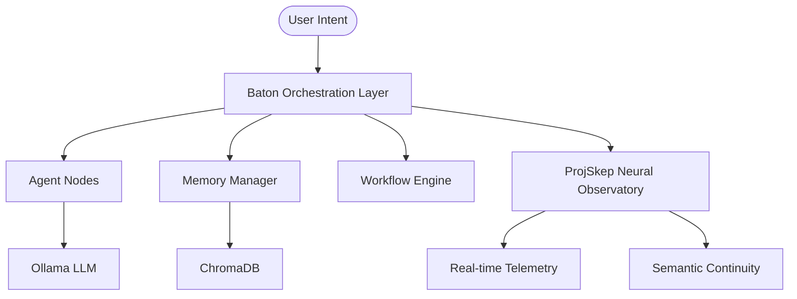
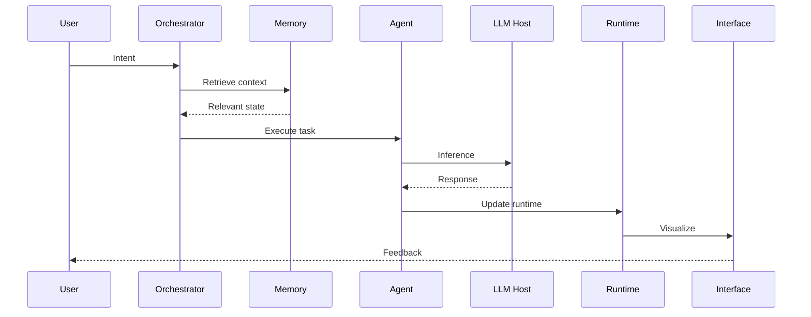
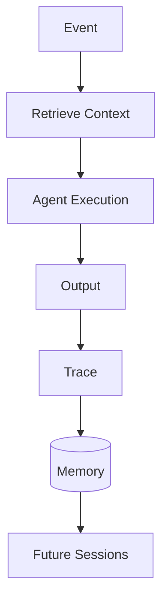

# Baton
### Cognitive Orchestration Layer for Persistent AI Workflows

Baton is a local-first orchestration system designed to preserve semantic continuity across AI-assisted engineering workflows.

Modern AI systems are powerful at execution but weak at continuity. Context resets, architectural decisions disappear, and long debugging sessions fragment over time.

Baton exists to preserve:

**Intent → Context → Execution → Memory → Continuity**

Its architecture separates:

- **Human → Strategic intent**
- **Laptop → Orchestration**
- **PC → Model hosting**
- **Memory → Persistence**
- **Agents → Specialized execution**
- **Observability → Cognitive visualization**

Goal:

Reduce semantic drift, preserve reasoning continuity, and maintain architectural coherence during long AI-assisted workflows.

---

## Architecture



See [docs/architecture.md](docs/architecture.md) for full component breakdown.

### Execution Model

The system distributes responsibility:

| Layer | Responsibility |
|--------|----------------|
| User | Strategic intent |
| Laptop | Orchestration + routing |
| Agents | Task specialization |
| Memory | Retrieval + continuity |
| Runtime | Event execution |
| PC | Model inference |
| UI | Observability |

The laptop does **not** run heavy models.

```txt
Laptop:
Orchestration
Routing
Retrieval
Agent coordination

↓

PC:
LLM hosting
Inference
Model execution

↓

Memory:
Persistence
Continuity
Trace storage
```

### Cognitive Execution Flow



Execution becomes observable. Reasoning becomes traceable.

### Persistence Model



Every execution becomes future context. The system accumulates continuity instead of restarting cognition.

---

## Why Baton Exists

Traditional AI workflows fail because:

- Context resets between sessions
- Architectural decisions disappear
- Debugging arcs lose continuity
- Agents drift from established reasoning
- Long projects accumulate cognitive fragmentation

Baton attempts to preserve:

```txt
Intent
 ↓
Context
 ↓
Execution
 ↓
Memory
 ↓
Continuity
```

The objective is not bigger models. The objective is sustained reasoning.

---

## Run in 5 minutes

**Requirements**
- Python 3.11+
- Docker
- Ollama running locally with `phi4` model

**Install**
```bash
git clone https://github.com/swappy-ops/baton
cd baton
cp .env.example .env
docker build -t baton:latest .
docker run --rm -d --name baton -p 8000:8000 -v $(pwd):/app baton:latest
```

**Verify**
```bash
curl http://localhost:8000/api/status
# → {"status":"operational","system":"Baton Neural Observatory"}
```

Open `http://localhost:8000` — observatory UI loads with live telemetry.

**Dev mode**
```bash
./launch_dev.ps1
```

This boots backend services, agent runtime, WebSocket bus, retrieval systems, memory services, observability UI, and health monitoring.

---

## Integrations

| System | Role | Docs |
|--------|------|------|
| ProjSkep | Semantic memory, neural observatory | [integrations/projskep](integrations/projskep/README.md) |
| Ollama | Local LLM inference | [docs/integrations.md](docs/integrations.md) |
| ChromaDB | Vector retrieval | [docs/integrations.md](docs/integrations.md) |

---

## Core Principles

### Retrieval First

Bounded context outperforms unbounded context. The system retrieves relevant state rather than maximizing tokens.

### Continuity Preservation

Architectural decisions persist across sessions. Reasoning becomes cumulative.

### Event Driven

Filesystem changes, runtime events, and user actions trigger execution.

### Observability

Complex systems become manageable when cognition is visible.

### Sparse Activation

Only relevant agents activate for a given task. Reduce noise. Increase signal.

---

## Modes

| Mode | Focus |
|------|-------|
| DEBUG | Forensic trace, dependency propagation |
| RESEARCH | Retrieval-heavy, semantic exploration |
| BUILD | Code generation, continuity checks |
| DEEP_WORK | Noise suppression, focused context |

Switch via CMD+K in the UI.

---

## Methodology

- [Global Rules](docs/methodology/global-rules.md)
- [Failure Patterns](docs/methodology/failure-patterns.md)
- [Architecture](docs/architecture.md)

---

## Example Workflow

```txt
User:
"Debug this failing VST3 build"

↓

Retrieve:
Previous traces
Architecture decisions
Related files

↓

Agent:
Analyze
Execute
Reason

↓

Model Host:
Inference

↓

Runtime:
Update state

↓

Memory:
Store trace

↓

Future:
Faster reasoning
Preserved continuity
```

---

## Long-Term Vision

Traditional IDE:

```txt
Human → Code
```

Baton:

```txt
Human
 ↓
Intent
 ↓
Agents
 ↓
Memory
 ↓
Runtime
 ↓
Models
 ↓
Feedback
 ↓
Persistence
```

The system becomes an external cognitive layer rather than a temporary assistant.

---

## Roadmap

- [ ] Forensic Playback 2.0
- [ ] Adaptive telemetry noise suppression
- [ ] Multi-agent bridge visualization
- [ ] Ollama agent hot-swap
- [ ] Distributed execution
- [ ] Long-horizon memory optimization
- [ ] Visual reasoning replay
- [ ] Multi-host orchestration

---

## Philosophy

> Complexity is managed through observability.

The goal is not replacing human reasoning. The goal is preserving it.

---

## License

MIT — see [LICENSE](LICENSE)

---

Built by **@swappy-ops**
