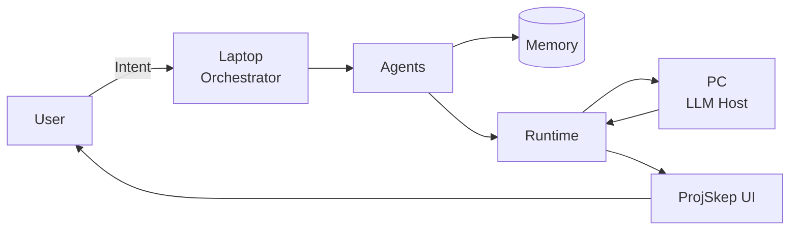
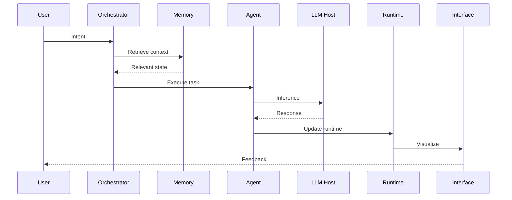
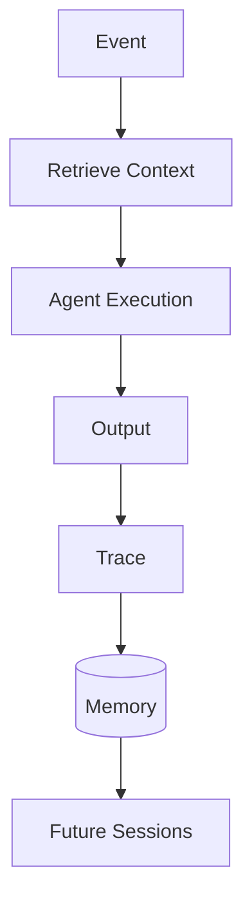

# Baton
### Cognitive Orchestration Layer for Persistent AI Workflows

Baton is a local-first orchestration system designed to preserve semantic continuity across AI-assisted engineering workflows.

Modern AI systems are powerful at execution but weak at continuity. Context resets, architectural decisions disappear, and long debugging sessions fragment over time.

Baton exists to preserve:

**Intent → Context → Execution → Memory → Continuity**

Its architecture separates:

- **Human → Strategic intent**
- **Laptop → Orchestration**
- **PC → Model hosting**
- **Memory → Persistence**
- **Agents → Specialized execution**
- **Observability → Cognitive visualization**

Goal:

Reduce semantic drift, preserve reasoning continuity, and maintain architectural coherence during long AI-assisted workflows.

---

# Architecture



### Execution Model

The system distributes responsibility:

| Layer | Responsibility |
|--------|----------------|
| User | Strategic intent |
| Laptop | Orchestration + routing |
| Agents | Task specialization |
| Memory | Retrieval + continuity |
| Runtime | Event execution |
| PC | Model inference |
| UI | Observability |

The laptop does **not** run heavy models.

Architecture:

```txt
Laptop:
Orchestration
Routing
Retrieval
Agent coordination

↓

PC:
LLM hosting
Inference
Model execution

↓

Memory:
Persistence
Continuity
Trace storage
```

---

# Why Baton Exists

Traditional AI workflows fail because:

- Context resets between sessions
- Architectural decisions disappear
- Debugging arcs lose continuity
- Agents drift from established reasoning
- Long projects accumulate cognitive fragmentation

Baton attempts to preserve:

```txt
Intent
 ↓
Context
 ↓
Execution
 ↓
Memory
 ↓
Continuity
```

The objective is not bigger models.

The objective is sustained reasoning.

---

# Repository Structure

```txt
baton/
│
├── agents/              # Specialized execution agents
├── configs/             # Runtime configuration
├── docs/                # Documentation
├── graphs/              # Topology/state graphs
├── memory/              # Persistence layer
├── retrieval/           # Context retrieval
├── runtime/             # Event execution
├── tasks/               # Task definitions
│
├── projskep_ui/         # Observability interface
├── projskep_server/     # Backend services
├── projskep_memory/     # Memory subsystem
│
├── orchestrator.py      # Main routing logic
├── multi_agent.py       # Agent coordination
├── watcher_agent.py     # Filesystem monitoring
├── tools_agent.py       # Tool execution
├── projskep_core.py     # Core runtime
│
├── launch_dev.ps1       # Full stack boot
└── README.md
```

---

# Cognitive Execution Flow



Execution becomes observable.

Reasoning becomes traceable.

---

# Persistence Model



Every execution becomes future context.

The system accumulates continuity instead of restarting cognition.

---

# Core Principles

## Retrieval First

Bounded context outperforms unbounded context.

The system retrieves relevant state rather than maximizing tokens.

---

## Continuity Preservation

Architectural decisions persist across sessions.

Reasoning becomes cumulative.

---

## Event Driven

Filesystem changes, runtime events, and user actions trigger execution.

---

## Observability

Complex systems become manageable when cognition is visible.

---

## Sparse Activation

Only relevant agents activate for a given task.

Reduce noise.

Increase signal.

---

# Running Baton

Start the full stack:

```bash
./launch_dev.ps1
```

This boots:

- Backend services
- Agent runtime
- WebSocket bus
- Retrieval systems
- Memory services
- Observability UI
- Health monitoring

---

# Current State

Implemented:

- [x] Multi-agent runtime
- [x] Retrieval layer
- [x] Memory persistence
- [x] Orchestration core
- [x] Event watcher
- [x] ProjSkep integration
- [x] Agent coordination

In Progress:

- [ ] Forensic replay engine
- [ ] Adaptive telemetry
- [ ] Agent negotiation visualization
- [ ] Advanced topology mapping
- [ ] Runtime diagnostics

Planned:

- [ ] Distributed execution
- [ ] Long-horizon memory optimization
- [ ] Visual reasoning replay
- [ ] Multi-host orchestration

---

# Example Workflow

```txt
User:
"Debug this failing VST3 build"

↓

Retrieve:
Previous traces
Architecture decisions
Related files

↓

Agent:
Analyze
Execute
Reason

↓

Model Host:
Inference

↓

Runtime:
Update state

↓

Memory:
Store trace

↓

Future:
Faster reasoning
Preserved continuity
```

---

# Long-Term Vision

Traditional IDE:

```txt
Human → Code
```

Baton:

```txt
Human
 ↓
Intent
 ↓
Agents
 ↓
Memory
 ↓
Runtime
 ↓
Models
 ↓
Feedback
 ↓
Persistence
```

The system becomes an external cognitive layer rather than a temporary assistant.

---

# Philosophy

> Complexity is managed through observability.

The goal is not replacing human reasoning.

The goal is preserving it.

---

Built by:

**@swappy-ops**
