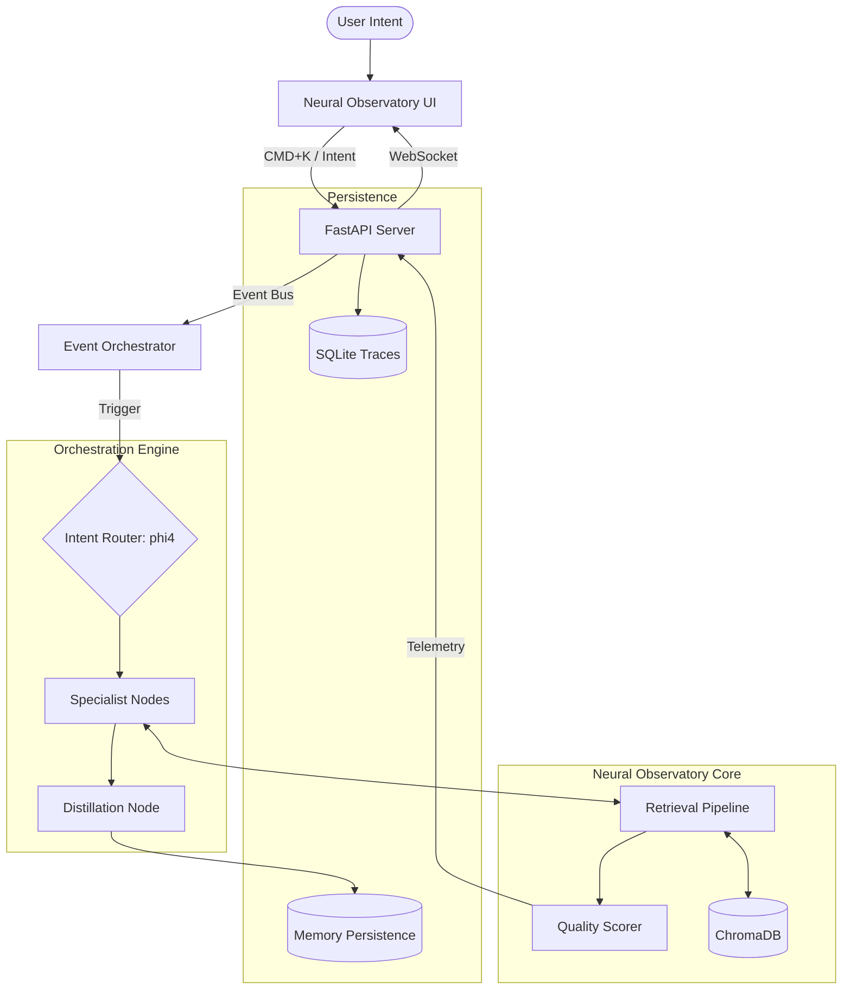

# ProjSkep
## Neural Observatory & Cognitive Control Surface

> **"Clarity under complexity is not a luxury; it is the fundamental requirement for sustained engineering reasoning."**

ProjSkep is a production-grade **Neural Observatory** and **Cognitive Control Surface** designed for event-driven orchestration, semantic continuity, and real-time observability. It is a local-first, retrieval-hardened environment that transforms the act of coding and architectural thinking into an immersive, observable experience.

---

##  Architectural Philosophy

ProjSkep is **not** an AI chatbot. It is **not** a dashboard. It is a **Cognitive Operating Environment**.

The system is built on the premise that as AI-orchestrated workflows scale, the primary bottleneck becomes **cognitive reload** and **semantic drift**. ProjSkep solves this by externalizing the reasoning process into a reactive, visual substrate—a "black box recorder" for human-AI collaboration.

### The ProjSkep Core:
- **Retrieval-First Execution**: Bounded, deterministic context injection.
- **Semantic Continuity**: Persistent architectural governance via the DOS (Documentation Operating System).
- **Event-Driven Orchestration**: Real-time reaction to filesystem deltas and telemetry streams.
- **Sparse Activation**: High-performance specialist nodes optimized for low-VRAM (AMD RX 6600) environments.

---

##  System Topology



---

##  Key Features

###  Real-Time Topology Map
The heart of the observatory. A live, reactive graph visualizing execution chains, dependency propagation, and orchestration deltas. Watch the system breathe as it reacts to your code.

###  Context Budget Intelligence
Visualizing token economics in real-time. Monitor **Prompt Overhead**, **Memory Injection**, and **Semantic Redundancy** via animated radial gauges to prevent cognitive inflation.

###  Forensic Replay Engine
A cognition black box. Scrub through past sessions, reconstruct topology states, and replay the evolution of an investigation. Perfect for post-mortem analysis of complex debugging arcs.

###  Continuity Preservation
The system monitors for **Semantic Drift**. Every automated suggestion is audited against the established **ARCHITECTURE_MAP.md** and **TERMINOLOGY.md**, ensuring the project's soul remains intact.

###  Intent Control Core
Shift the system's entire cognitive focus via **CMD+K**. Toggle between **DEBUG**, **RESEARCH**, **BUILD**, and **DEEP_WORK** modes—each profile re-weighting retrieval, telemetry filtering, and topology emphasis.

---

##  Operational Workflows

### The VST3 Debugging Arc
ProjSkep’s primary operational validation path.
1. **Detect**: System identifies a modification in a VST3 plugin file.
2. **Retrieve**: Automatically pulls historical traces and related memory chunks.
3. **Visualize**: Propagates a dependency chain in the Topology Map.
4. **Audit**: Identifies continuity risks in the BridgeManager logic.
5. **Propose**: Generates high-fidelity suggestions for human approval.

---

##  Quick Start

### Coordinated Startup
ProjSkep features a single-command orchestration boot.

```powershell
# In the project root
./launch_dev.ps1
```

This script:
1. Initializes the **FastAPI** backend (Port 8000).
2. Establishes the **WebSocket** event bus.
3. Compiles the **React** control surface (Port 5173).
4. Boots the **Filesystem Watcher** orchestrator.
5. Verifies system health and auto-opens the UI.

---

##  Tech Stack

- **Core**: Python 3.11 / FastAPI / Pydantic v2
- **UI**: React / Vite / TypeScript / TailwindCSS
- **Visualization**: React Flow / Framer Motion
- **Database**: ChromaDB (Vector) / SQLite (Traces)
- **AI**: Ollama (phi4, qwen2.5-coder:7b)
- **Acceleration**: ROCm / Vulkan (Optimized for AMD RX 6600)

---

##  Daily Operation Guide

1. **Enter Your Mode**: Use `CMD+K` to set your Intent.
2. **Watch the Flow**: Keep the Observatory open; watch for propagation pulses in the Topology Map.
3. **Capture Friction**: Use `CMD+SHIFT+F` to report UI noise or retrieval gaps. This populates **FRICTION_LOG.md**.
4. **Scrub the Past**: Use the Replay Panel to revisit complex reasoning paths if you lose track of the investigation.

---

##  Cognitive Philosophy

> **"Complexity is managed not by reduction, but by observability."**

ProjSkep exists to reduce the entropy of development. By preserving continuity, bounding cognition, and visualizing orchestration, it allows the engineer to maintain **Flow State** even within highly fragmented, AI-assisted workflows.

---

##  Roadmap
- [ ] **Forensic Playback 2.0**: Frame-by-frame state inspection.
- [ ] **Adaptive Telemetry**: Dynamic noise suppression based on user heart-rate/focus.
- [ ] **Topology Virtualization**: Supporting >1000 node graphs at 120fps.
- [ ] **Multi-Agent Bridge**: Visualizing inter-agent negotiation protocols.

---
**ProjSkep** | Developed by the ProjSkep Systems Engineering Team.
**Operational Status**: ACTIVE.
**Vessel**: Neural Observatory.
