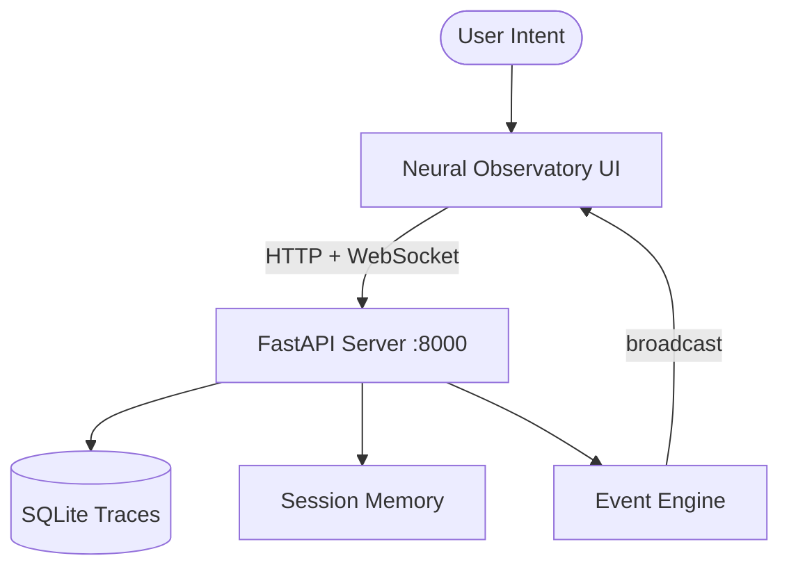

# Baton

### Cognitive Orchestration Layer for Persistent AI Workflows

Baton is a local-first orchestration system that preserves semantic continuity across AI-assisted engineering workflows.

Modern AI systems are powerful at execution but weak at continuity. Context resets, architectural decisions disappear, and long debugging sessions fragment over time.

Baton preserves: **Intent → Context → Execution → Memory → Continuity**

---

## Quick Start

### Option 1: Docker (Recommended)

```bash
git clone https://github.com/swappy-ops/baton
cd baton
cp .env.example .env
docker compose up -d
```

Open http://localhost:8000 — the Neural Observatory UI loads with live telemetry.

Verify:
```bash
curl http://localhost:8000/api/status
```

### Option 2: Local Install

```bash
git clone https://github.com/swappy-ops/baton
cd baton
./install.sh    # Linux/macOS
# or
.\install.ps1   # Windows
./run.sh        # Linux/macOS
# or
.\run.ps1       # Windows
```

### Option 3: Manual

```bash
git clone https://github.com/swappy-ops/baton
cd baton
python3 -m venv .venv
source .venv/bin/activate   # or .venv\Scripts\Activate.ps1 on Windows
pip install -r requirements-server.txt
cp .env.example .env
uvicorn baton_server.main:app --host 0.0.0.0 --port 8000
```

---

## Architecture



| Component | Role |
|-----------|------|
| FastAPI Server | HTTP API + WebSocket hub |
| Neural Observatory UI | Real-time telemetry dashboard (vanilla HTML/CSS/JS) |
| SQLite | Trace logging and forensic replay |
| Session Memory | JSON-based session state persistence |
| Event Bus | Publish/subscribe with attention scoring |
| Orchestration Engine | Telemetry streams and background workflows |

See [docs/ARCHITECTURE.md](docs/ARCHITECTURE.md) for full component breakdown.

---

## API Endpoints

| Endpoint | Method | Description |
|----------|--------|-------------|
| `/` | GET | Neural Observatory UI |
| `/api/status` | GET | System health check |
| `/api/metrics` | GET | System metrics (DB size, trace count, etc.) |
| `/api/session` | GET | Current session state |
| `/api/intent` | POST | Submit user intent |
| `/api/friction` | POST | Report friction point |
| `/ws` | WebSocket | Real-time event stream |

---

## Integrations

| System | Role |
|--------|------|
| Ollama | Local LLM inference (optional) |
| ChromaDB | Vector retrieval (used by baton/ package) |

---

## Project Structure

```
baton/
├── baton_server/          # FastAPI server (runtime)
│   ├── main.py            # Entry point
│   ├── api/               # REST endpoints
│   ├── websocket/         # WebSocket manager
│   ├── db/                # SQLite + session storage
│   ├── services/          # Event bus, attention engine, etc.
│   ├── orchestration/     # Telemetry engine
│   ├── schemas/           # Pydantic models
│   └── static/            # Observatory UI
├── baton/                 # Agent orchestration package (optional ML stack)
│   ├── agents/            # LangGraph nodes
│   ├── memory/            # Memory management
│   ├── retrieval/         # ChromaDB pipeline
│   ├── runtime/           # Task contracts, budgets, stability
│   └── graphs/            # LangGraph workflows
├── archive/               # Archived prototypes and legacy files
└── docs/                  # Documentation
```

---

## Modes

| Mode | Focus |
|------|-------|
| DEBUG | Forensic trace, dependency propagation |
| RESEARCH | Retrieval-heavy, semantic exploration |
| BUILD | Code generation, continuity checks |
| DEEP_WORK | Noise suppression, focused context |

Switch via CMD+K in the UI.

---

## Core Principles

- **Retrieval First** — Bounded context outperforms unbounded context
- **Continuity Preservation** — Architectural decisions persist across sessions
- **Event Driven** — Filesystem changes and user actions trigger execution
- **Observability** — Complex systems become manageable when cognition is visible
- **Sparse Activation** — Only relevant agents activate for a given task

---

## Roadmap

- [ ] Wire Ollama agents into the server runtime
- [ ] Build React/Vite frontend to replace static HTML UI
- [ ] Add pre-commit hooks for commit discipline
- [ ] Forensic Playback 2.0
- [ ] Adaptive telemetry noise suppression
- [ ] Multi-agent bridge visualization
- [ ] Distributed execution

---

## Contributing

See [CONTRIBUTING.md](CONTRIBUTING.md) for development guidelines.

---

## License

MIT — see [LICENSE](LICENSE)

---

Built by **@swappy-ops**
