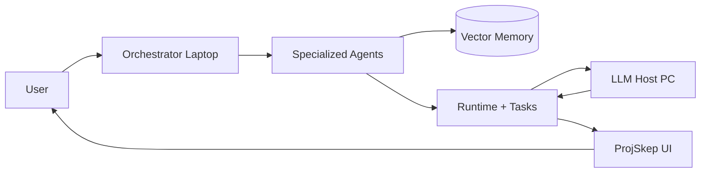
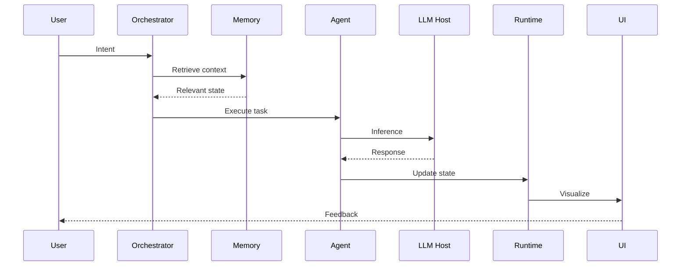

# Baton
### Cognitive Orchestration Layer for Persistent AI Workflows

Baton is a local-first orchestration system designed to preserve semantic continuity across AI-assisted engineering workflows.

It separates:

- **Human → Intent**
- **Laptop → Orchestration**
- **PC → Model Host**
- **Memory → Persistence**
- **Agents → Specialized execution**
- **Observability → Cognitive state visualization**

Goal:

Reduce context loss, semantic drift, and architectural inconsistency during long AI workflows.

---

# Architecture



---

# System Roles

| Component | Role |
|-----------|------|
| User | Strategic intent |
| Laptop | Orchestration layer |
| PC | Hosts models |
| Memory | Retrieval + continuity |
| Agents | Specialized execution |
| Runtime | Event routing |
| UI | Observability |

---

# Repository Structure

```txt
baton/

agents/
configs/
docs/
graphs/
memory/
runtime/
retrieval/
tasks/

projskep_ui/
projskep_server/
projskep_memory/

orchestrator.py
multi_agent.py
projskep_core.py
watcher_agent.py
tools_agent.py

README.md
```

---

# Cognitive Execution Flow



---

# Persistence Model

```mermaid
graph TD

Event --> Retrieval
Retrieval --> Context
Context --> Agent
Agent --> Output
Output --> Trace
Trace --> Memory
Memory --> Future Sessions
```

---

# Core Principles

## Retrieval First
Bounded context > infinite context

## Continuity Preservation
Architectural consistency across sessions

## Event Driven
Filesystem + runtime changes trigger execution

## Observability
Reasoning becomes inspectable

---

# Running Baton

Start full stack:

```bash
./launch_dev.ps1
```

Boots:

- Backend
- Websocket bus
- Agent runtime
- UI
- Memory services
- Monitoring

---

# Current State

Implemented:

- [x] Multi-agent runtime
- [x] Retrieval layer
- [x] Memory persistence
- [x] Orchestration core
- [x] Event watcher
- [x] ProjSkep integration

In Progress:

- [ ] Forensic replay
- [ ] Adaptive telemetry
- [ ] Agent negotiation visualization
- [ ] Advanced topology maps

---

# Long-Term Vision

Traditional IDE:

Human → Code

Baton:

Human → Intent → Agents → Memory → Runtime → Models → Feedback → Persistence

The system becomes an external cognitive substrate.

---

Built by:
@swappy-ops
