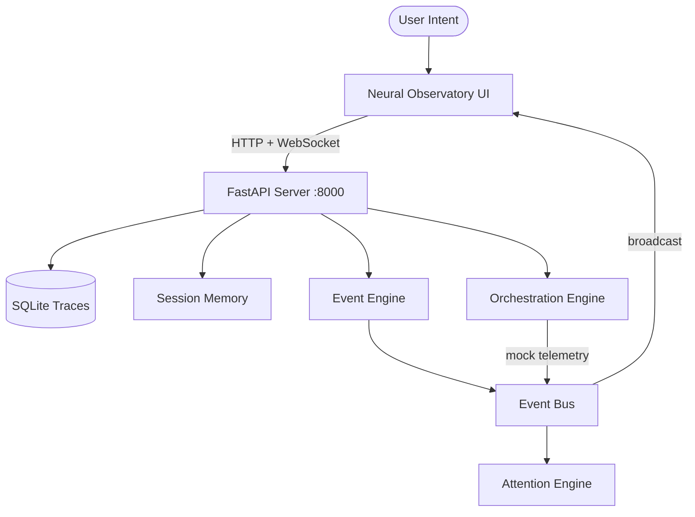

# Baton Architecture

## Overview
Baton is a local-first cognitive orchestration runtime. It preserves semantic continuity across AI-assisted engineering workflows.

## System Diagram

## Components

| Component | Path | Role | Status |
|-----------|------|------|--------|
| FastAPI Server | `baton_server/main.py` | HTTP API + WebSocket hub | ACTIVE |
| API Router | `baton_server/api/` | `/api/status`, `/api/session`, `/api/intent`, `/api/friction` | ACTIVE |
| WebSocket Manager | `baton_server/websocket/manager.py` | Connection pool, keepalive, broadcast | ACTIVE |
| SQLite DB | `baton_server/db/manager.py` | Trace logging, suggestions | ACTIVE |
| Session Memory | `baton_server/services/session_memory.py` | JSON-based session state, keeps last 5 | ACTIVE |
| Event Bus | `baton_server/services/event_bus.py` | Publish/subscribe with attention scoring | ACTIVE |
| Attention Engine | `baton_server/services/attention_engine.py` | Signal scoring, noise filtering | ACTIVE |
| Orchestration Engine | `baton_server/orchestration/engine.py` | Mock telemetry streams, background workflows | ACTIVE |
| UI | `baton_server/static/index.html` | Neural Observatory — vanilla HTML/CSS/JS | ACTIVE |

## External Dependencies (Optional)

| System | Role | Connection |
|--------|------|------------|
| Ollama | LLM inference | `OLLAMA_HOST` env var (default: `http://host.docker.internal:11434`) |
| ChromaDB | Vector retrieval | `baton_memory/` directory (used by `baton/` package only) |

## baton/ Package
The `baton/` directory contains the full agent orchestration layer (LangGraph graphs, retrieval pipeline, memory management, task contracts). It requires heavy dependencies (chromadb, sentence-transformers, langchain, langgraph) and is NOT included in the minimal Docker image. It is designed for local development with full ML stack.

## Data Flow
1. User opens `http://localhost:8000` — UI loads
2. UI connects WebSocket to `/ws`
3. User sends intent via CMD+K or input field
4. Server logs intent to session memory + SQLite
5. Orchestration Engine generates mock telemetry every 3s
6. Background workflows trigger every 15s
7. All events flow through Event Bus → Attention Engine → WebSocket broadcast
8. UI renders real-time topology, traces, gauges, event log
