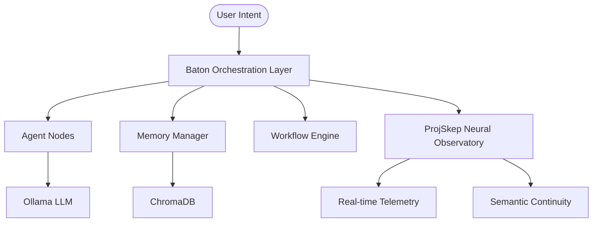

# Baton Architecture

Auto-generated. Do not edit manually — run scripts/update_architecture.py

## Components

| Component | Path | Role |
|-----------|------|------|
| Orchestration Server | baton_server/ | FastAPI, WebSocket, event routing |
| Agent Layer | baton/agents/ | LangGraph nodes, intent routing |
| Memory | baton/memory/ | ChromaDB retrieval pipeline |
| Runtime | baton/runtime/ | Context budget, task contracts |
| Workflows | baton/graphs/ | LangGraph orchestration graphs |
| UI | baton_ui/ | React/Vite control surface |
| Integrations | integrations/ | External system connectors |
