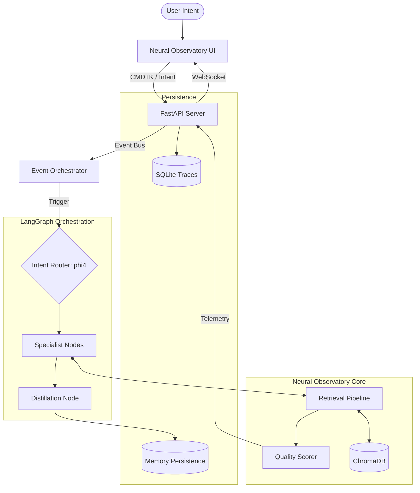

# ARCHITECTURE_MAP.md - Spatial System Topology

## Cognition & Observation Flow

## Component Boundaries
- **Control Surface**: `projskep_ui/` - React-based reactive dashboard.
- **Backend Hub**: `projskep_server/` - FastAPI, WebSocket manager, and event routing.
- **Orchestration**: `graphs/router_graph.py` & `scripts/event_orchestrator.py`.
- **Retrieval**: `retrieval/pipeline.py` - Vector index with quality scoring.
- **Memory**: `memory/manager.py` - Distillation of findings.
- **Observability**: `traces/` - Structured execution and audit logs.
